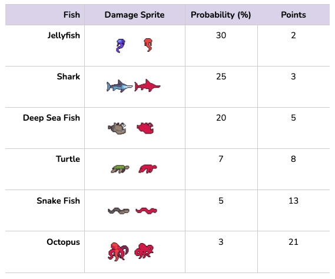

# Voila Learning - Exercise - Fishing Game
As part of the hiring process to Voila Learning, this project aims to build a fishing game.

## Documentation
[https://docs.google.com/document/d/1rOVUAQNLvTtP5S6TnqCpM4Xf7yTAqpgM6RDLNLiQGLU/edit](https://docs.google.com/document/d/1rOVUAQNLvTtP5S6TnqCpM4Xf7yTAqpgM6RDLNLiQGLU/edit)

## GitHub
[https://github.com/fscouto-toptal/voila-exercise-fishing](https://github.com/fscouto-toptal/voila-exercise-fishing)

## Problem Statement
Create a 2D project where the player can dangle a hook into a pool of water to catch fish. The score is assigned based on fish caught during a 1 minute period of play.

## Context
The challenge consists of the creation of a fishing game with Unity.

### Non functional Requirements
- 2D game
- Public free assets

### Requirements
- The game scenario has to show the deep of a sea somehow
- Player handles a hook
- NPC's are fish that keeps swimming in the sea

### Open Questions
- Is the game single player (2 players or more)?
- Should we aim for a multiplayer mode?
- What are the degrees of freedom (left/right, top/down, etc.) for the hook?
- What is the behavior of the fish?
- Which/how data is persisted?

## Prototype Proposal
- Players: 1
- Game Modes: Offline
- Engine: Unity (version 2023.1.0b7)

### Player
The player controls a hook that dives in the water from the top of the playable area. Player's controller:
- It is possible to control the hook to go up or down only
- The hook stands in the middle of the playable area
- Use **Input System** [package](https://docs.unity3d.com/2023.1/Documentation/Manual/com.unity.inputsystem.html) for the player input controller

### NPC
The main objective of the game is to catch as many fish as possible. Each existing fish will be an NPC.
The behavior of the fish NPC will be defined as following:
- The fish will be spawned in turns
  - The turns are consecutively and takes 2 seconds between each other
- Which fish to spawn is defined randomly, and each fish has a probability of being spawned
  - The sum of all probabilities is 90%, which means there is a 10% chance of no fish being spawned in a turn
- When a fish is spawned, it will cross the water from left-to-right (right direction), or the other way around (left direction)
  - The direction will be defined randomly, with 50/50 percent chances for both directions
  - The height of the spawning point is also randomly decided, by sorting a number between 0 and 100. This number is normalized to the height of the playable area (where 0 is at the very bottom and 100 represents the top), so the fish is placed at the correct position in the Y axis
- When a fish is caught, the player earns points
  - Each fish has a different amount of point assigned to it
  - As rarer the fish, more points are assigned to the player, following a Fibonacci progression
There will be 6 types of fish. The table below shows each one of them, together with its sprites used for "damage" events, the probability of spawning and the amount of points of the referred fish.

### Gameplay
When the main gameplay starts, the player is given control over the hook and he can start the attempts to catch a fish, based on the movements defined in the player section. At the same time, the fish spawning process will kickstart. After every 2 seconds, one fish will be randomly chosen to be spawned in the left or right side of the water, at a random height, according to the definition in the NPC section.
Every time the player catches a fish, it earns its assigned points. The player has a final score, which is the sum of all points assigned to the fish he caught.

#### Game Ending Criteria
The gameplay finishes when the time is up, after 1 minute.

#### Winning Criteria
There is no winning criteria. So, the player only competes to break the best record, which is stored for future game results comparison.

### Data Persistence
The only data persisted (which lives between game runs) is the record of points. data is stored in the game persistent controller, which is responsible for storing a JSON data file locally.

### Main Menu
When the game is launched, there is a simple starting page, where the player can press the "Start" button to start a new gameplay. When the gameplay is finished, the player goes back to the starting page, which also shows the record of points.